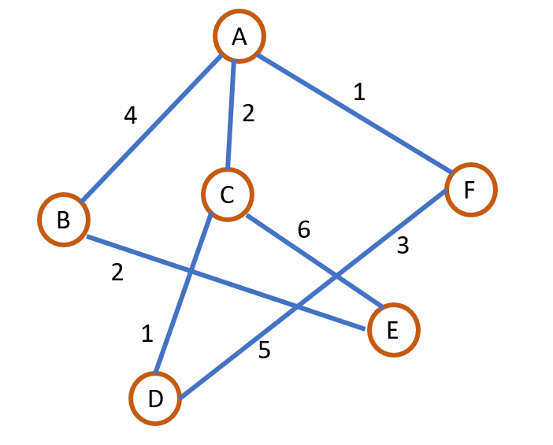
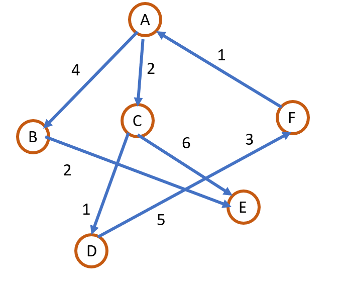
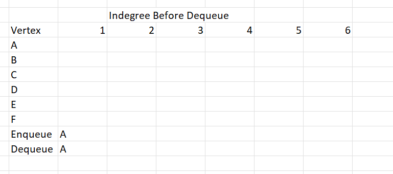
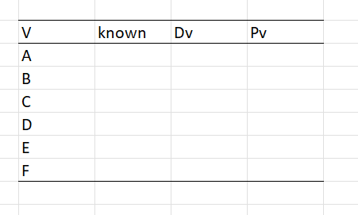

Question 1

Write the storage representation for following data structure.

Adjacency Matrix

Question 2

Identify the following method and complete it.

Question 3

What would be the configuration after C starting with A is known for Dijkstra’s algorithm for question 2?

